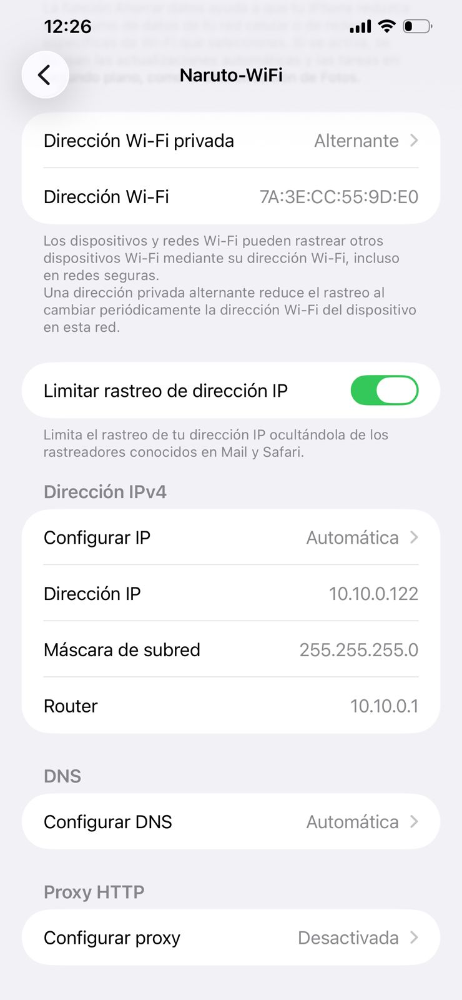
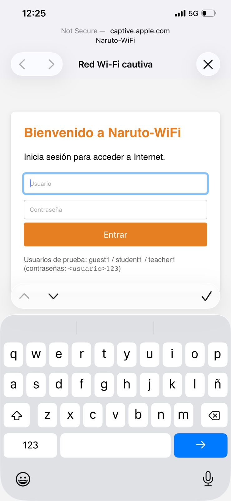
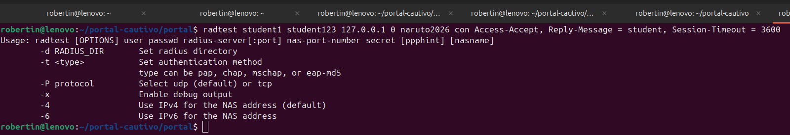
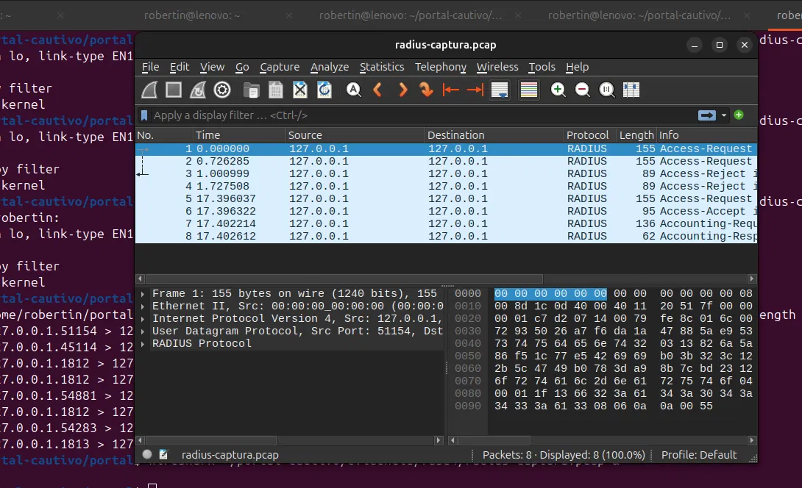
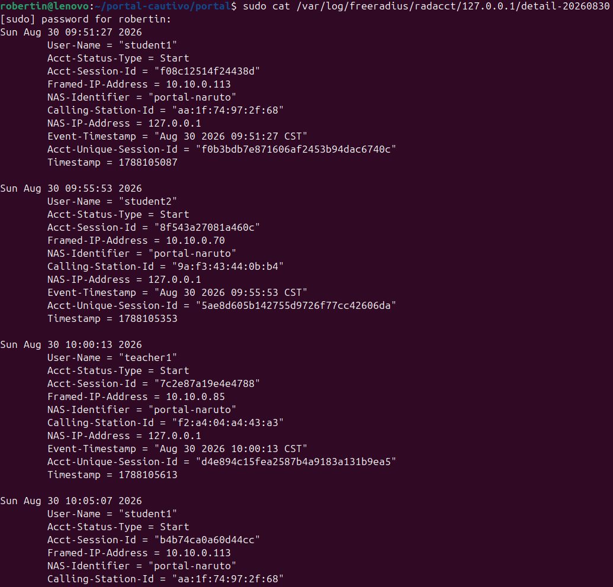

# Informe Técnico: Portal Cautivo con Radius - Naruto-WiFi


Roberto Ramírez — 7690-22-12700

05 de Agosto 2026

Universidad Mariano Gálvez Sede Boca del Monte

Telecomunicaciones

Ing. Luis Alvarado

Repositorio: [github.com/rramirezg18/portal-cautivo-radius](https://github.com/rramirezg18/portal-cautivo-radius)

---

## 1. Introducción

Este proyecto implementa un portal cautivo funcional, publicado desde una laptop Ubuntu como punto de acceso WiFi real, con autenticación centralizada mediante un servidor RADIUS (FreeRADIUS) y registro de sesiones (accounting).

El objetivo pedagógico central es evidenciar la diferencia entre la asociación WiFi (capa 2) y el acceso real a Internet (capa 3+): el cliente se asocia al SSID sin problema, pero no obtiene salida a Internet hasta autenticarse en el portal contra RADIUS.

## 2. Arquitectura

```
[Celular cliente] --WiFi--> [wlp2s0: 10.10.0.1] --NAT--> [usb0] --> Internet
                                    |
                                    +-- hostapd     (AP)
                                    +-- dnsmasq     (DHCP/DNS)
                                    +-- nftables    (NAT + intercept)
                                    +-- FreeRADIUS  (AAA)
                                    +-- Flask       (portal)
```

- **Red del AP:** `10.10.0.0/24`, gateway `10.10.0.1`
- **Uplink:** tethering USB desde celular (`usb0`)
- **Interfaz AP:** WiFi integrada (`wlp2s0`, chipset Realtek RTL8822CE)

## 3. Componentes

| Componente | Herramienta | Función |
|---|---|---|
| Punto de acceso WiFi | hostapd | Publica SSID `Naruto-WiFi` en canal 6 |
| DHCP + DNS | dnsmasq | Asigna IPs `10.10.0.50-200`, resuelve DNS |
| NAT + firewall | nftables | Enmascara hacia `usb0`, intercepta HTTP no autenticado |
| Servidor AAA | FreeRADIUS 3.2 | Valida credenciales por CHAP, registra accounting |
| Portal cautivo | Flask + pyrad | Login web, gestión de sesiones autorizadas |

## 4. Configuración

### 4.1 hostapd

```ini
interface=wlp2s0
driver=nl80211
ssid=Naruto-WiFi
hw_mode=g
channel=6
country_code=GT
ieee80211n=1
wmm_enabled=1
auth_algs=1
wpa=0
```

El AP publica una red abierta. La autenticación se realiza en capa de aplicación (portal).

### 4.2 dnsmasq

```ini
interface=wlp2s0
bind-interfaces
dhcp-range=10.10.0.50,10.10.0.200,12h
dhcp-option=3,10.10.0.1
dhcp-option=6,10.10.0.1
server=1.1.1.1
server=8.8.8.8
```

### 4.3 nftables

```nft
table ip portal_nat {
    set allowed_ip {
        type ipv4_addr
        flags timeout
    }

    chain prerouting {
        type nat hook prerouting priority -100;
        udp dport { 53, 67, 68 } accept
        tcp dport 53 accept
        ip daddr 10.10.0.1 accept
        ip saddr @allowed_ip accept
        iifname "wlp2s0" tcp dport 80 redirect to :80
    }

    chain postrouting {
        type nat hook postrouting priority 100;
        oifname "usb0" masquerade
    }

    chain forward {
        type filter hook forward priority 0; policy drop;
        ct state established,related accept
        ip saddr @allowed_ip oifname "usb0" accept
    }
}
```

El set `allowed_ip` es dinámico y con timeout: el portal Flask agrega elementos cuando un usuario se autentica y expiran automáticamente al llegar al `Session-Timeout` recibido de RADIUS.

### 4.4 FreeRADIUS

**Usuarios** (`mods-config/files/authorize`):

```
student1  Cleartext-Password := "student123"
          Reply-Message := "student",
          Session-Timeout := 3600
```

Se definen 5 usuarios con roles diferenciados (guest, student, teacher, staff) y timeouts distintos. El atributo `Reply-Message` se usa como transportador del rol hacia el portal.

**Cliente RADIUS** (`clients.conf`):

```
client localhost {
    ipaddr = 127.0.0.1
    secret = naruto2026
    require_message_authenticator = no
}
```

### 4.5 Portal Flask

El portal implementa el flujo:

1. Recibe el POST con usuario y contraseña.
2. Construye un paquete Access-Request con autenticación CHAP.
3. Envía a FreeRADIUS.
4. Si es `Access-Accept`: extrae `Reply-Message` y `Session-Timeout`, agrega la IP del cliente a `allowed_ip` de nftables, envía `Accounting-Start`.
5. Si es `Access-Reject`: muestra error.
6. Un hilo watcher espera el timeout, revoca acceso y envía `Accounting-Stop`.

**Nota técnica**: se eligió CHAP en lugar de PAP porque `pyrad 2.4` (en Ubuntu 24.04 con Python 3.12) tiene un bug al cifrar contraseñas PAP con el secret compartido. CHAP calcula un hash MD5 con un challenge aleatorio y evita este problema, además de ser más seguro contra captura de tráfico.

## 5. Evidencias por fase

### Fase 1 — AP + DHCP + NAT

- Cliente asociado al AP (HONOR-X8a-5G) con IP `10.10.0.113` asignada por DHCP.
- NAT funcionando: el cliente navega a Internet a través del tethering USB.



### Fase 2 — Portal cautivo interceptando tráfico

- Cliente conecta al SSID y automáticamente aparece la ventana "Iniciar sesión en la red" (CNA de Android/iOS).
- El portal muestra login y permite autorización local (previa a integración con RADIUS).



### Fase 3 — RADIUS funcional

- FreeRADIUS con 5 usuarios de prueba y roles diferenciados.
- Validado con `radtest`: `Access-Accept` para credenciales válidas, `Access-Reject` para inválidas.



### Fase 4 — Integración portal + RADIUS

- Portal valida credenciales contra FreeRADIUS usando CHAP.
- Extrae `Reply-Message` (rol) y `Session-Timeout` de la respuesta.
- Captura Wireshark con el intercambio completo:
  - Access-Request → Access-Reject (credencial inválida)
  - Access-Request → Access-Accept (credencial válida)
  - Accounting-Request → Accounting-Response



### Fase 5 — Accounting

- FreeRADIUS registra automáticamente cada sesión en `/var/log/freeradius/radacct/`.
- Cada entrada incluye User-Name, Framed-IP, Calling-Station-Id (MAC), Session-Id, Timestamp.
- Al expirar la sesión, se envía Acct-Stop con `Acct-Session-Time` y `Acct-Terminate-Cause = Session-Timeout`.



## 6. Personalización de landing por rol

El portal aprovecha el atributo `Reply-Message` que RADIUS devuelve en el
`Access-Accept` para renderizar una landing distinta según el rol del usuario
autenticado. Esto demuestra que RADIUS no solo autoriza acceso, sino que
transporta atributos que el cliente (el portal) puede consumir para modificar
su comportamiento — exactamente como lo hacen los portales corporativos reales.

| Rol         | Contenido de la landing                                    |
|-------------|------------------------------------------------------------|
| invitado    | Recomendaciones de seguridad para WiFi pública             |
| estudiante  | Micro-quiz relacionado con la clase de redes               |
| docente     | Enlaces a recursos académicos internos simulados           |
| staff       | Panel administrativo con opciones de gestión simuladas     |

El portal selecciona la plantilla dinámicamente en función del rol recibido:

```python
return render_template(f"landing_{role}.html", user=user, role=role, remaining=timeout)
```

Todas las landings muestran el contador regresivo del `Session-Timeout` que
RADIUS devolvió en el `Access-Accept`, permitiendo comprobar en vivo que la
autorización expira automáticamente al llegar a cero.

### Capturas por rol

**Landing invitado** (fondo gris, tips de seguridad en WiFi pública):


**Landing estudiante** (fondo azul, micro-quiz de la clase):


**Landing docente** (fondo verde, recursos académicos simulados):


**Landing staff** (fondo morado, panel administrativo simulado):


## 7. Conclusiones

- Se logró implementar un portal cautivo completo, funcional y demostrable con dispositivos reales.
- La separación entre asociación WiFi y acceso a Internet quedó evidenciada: el cliente puede conectarse al SSID pero no navegar hasta autenticarse.
- RADIUS demostró su valor como sistema centralizado de AAA: no solo autentica, sino que transporta atributos (rol, timeout) que el portal aplica en tiempo real.
- El accounting permite auditoría completa de sesiones.
- La implementación con software libre (hostapd, dnsmasq, nftables, FreeRADIUS, Flask) es reproducible en cualquier laptop con soporte WiFi AP, sin requerir hardware especializado.

## 8. Referencias

- RFC 2865 — Remote Authentication Dial In User Service (RADIUS)
- RFC 2866 — RADIUS Accounting
- Documentación FreeRADIUS: https://freeradius.org
- Documentación hostapd: https://w1.fi/hostapd/
- Documentación nftables: https://wiki.nftables.org